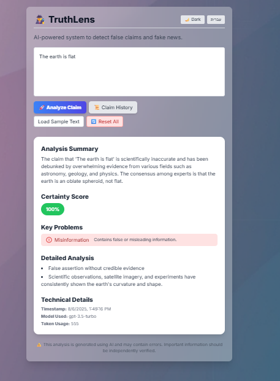
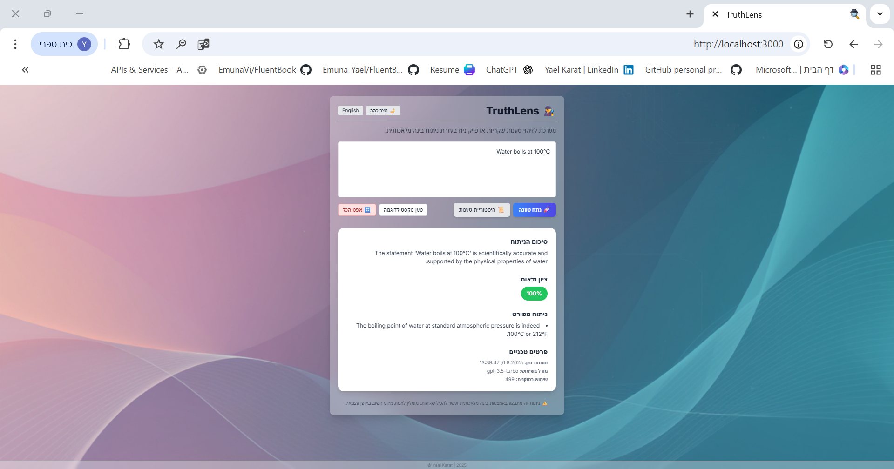
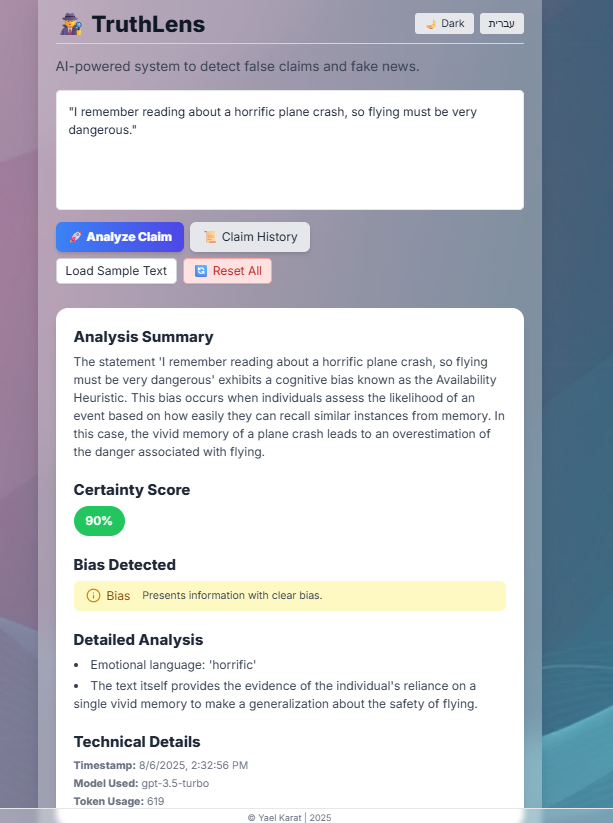
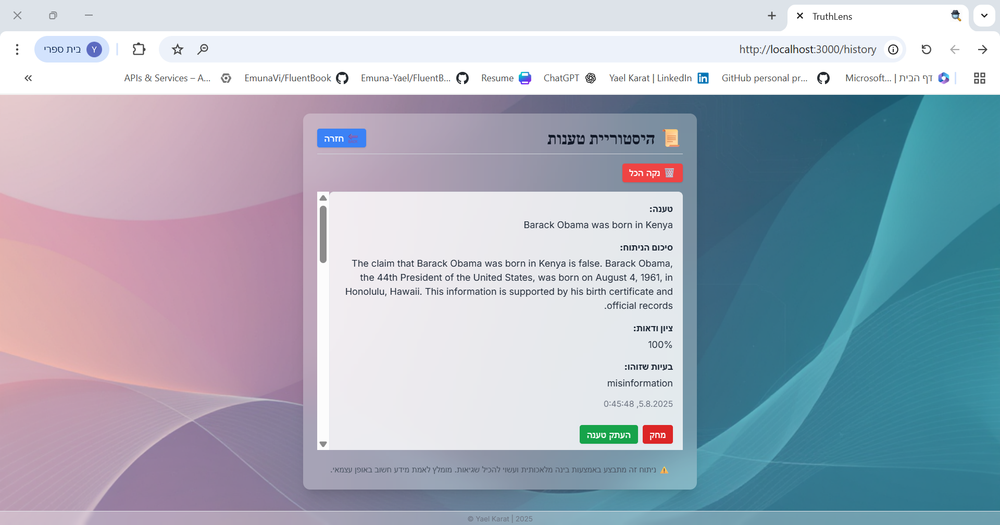
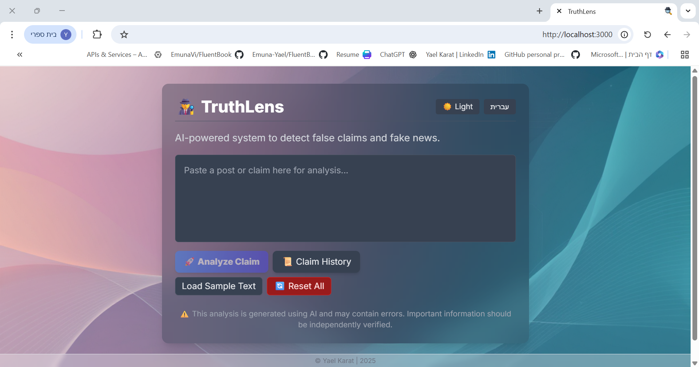

# TruthLens: AI-Powered Misinformation Detection Tool


## 📋 Table of Contents

- [Overview](#overview)
- [Features](#features)
- [Technology Stack](#technology-stack)
- [Installation](#installation)
- [Usage](#usage)
- [AI Integration](#ai-integration)
- [Project Structure](#project-structure)
- [Demo](#demo)
- [Testing](#testing)
- [Ethical Considerations](#ethical-considerations)
- [Limitations](#limitations)
- [Future Improvements](#future-improvements)
- [Contributing](#contributing)
- [License](#license)

## 🎯 Overview

TruthLens is an AI-powered misinformation detection tool designed to analyze and flag potentially misleading or biased information in social media content. The project was developed as part of the final project for "Between Theory and Practice: Preparing for Computing World Challenges" course.

This web application helps users evaluate the truthfulness of tweets, posts, headlines, and other short-form content by leveraging OpenAI's GPT-3.5-turbo API for comprehensive analysis including misinformation detection, bias identification, conspiracy language recognition, and factual incompleteness assessment.

### Project Goals

- **Critical Thinking Enhancement**: Assist users in developing digital literacy and media literacy skills
- **Real-time Analysis**: Provide immediate feedback on content credibility with structured JSON output
- **Cognitive Bias Detection**: Identify potential cognitive biases using 24 predefined bias definitions
- **Ethical AI Usage**: Demonstrate responsible implementation of AI technologies with advisory-only results
- **Multilingual Support**: Bilingual interface supporting Hebrew (RTL) and English (LTR) with dark mode

## ✨ Features

### Core Functionality

- **Content Analysis**: Accepts tweets, posts, headlines, and short-form social media content
- **AI-Powered Detection**: Uses OpenAI's GPT-3.5-turbo to assess content for misinformation, bias, conspiracy language, and factual incompleteness
- **Cognitive Bias Identification**: Detects and explains 24 different cognitive biases with detailed definitions
- **Structured JSON Output**: Provides consistent, parseable results with confidence scores (0-100%)
- **User-Friendly Interface**: Clean, intuitive design built with React.js and Tailwind CSS

### Advanced Features

- **Bilingual Support**: Full Hebrew (RTL) and English (LTR) interface with dynamic layout switching
- **Dark Mode**: Comprehensive dark theme support for better accessibility
- **History Management**: Local storage of analysis results using localStorage with review and deletion options
- **Privacy-First Design**: No server-side storage of user content or results
- **Responsive Design**: Mobile-friendly interface optimized for various screen sizes
- **Real-time Processing**: Instant analysis with retry logic for API failures

## 🛠 Technology Stack

### Backend (Python Flask)

- **Flask** - Lightweight web application framework
- **Python 3.x** - Server-side programming language
- **OpenAI API** - GPT-3.5-turbo integration for content analysis
- **Flask-CORS** - Cross-origin resource sharing support
- **python-dotenv** - Environment variable management

### Frontend (React.js)

- **React.js** - User interface framework with hooks (useState)
- **Tailwind CSS** - Utility-first CSS framework for styling
- **React Router** - Client-side routing for navigation
- **Framer Motion** - Animation library for smooth transitions
- **Lucide Icons** - Icon library for UI elements
- **clsx** - Utility for conditional CSS classes

### AI & APIs

- **OpenAI GPT-3.5-turbo** - Primary natural language processing and analysis engine
- **Structured Prompt Engineering** - Custom prompts designed for consistent JSON output
- **Retry Logic** - Automatic retry mechanism for failed API calls

### Storage & Deployment

- **localStorage** - Client-side storage for user analysis history
- **GitHub** - Version control and project hosting
- **Environment Variables** - Secure API key management

## 🚀 Installation

### 🎥 Setup Tutorial Resources

For detailed setup instructions, refer to these helpful resources mentioned in the original development:

- [Visual Studio Code Installation Tutorial (YouTube)](https://www.youtube.com/watch?v=PnmB5unjChY)
- [How To Get Your OpenAI API Key (YouTube)](https://www.youtube.com/watch?v=hSVTPU-FVLI)
- [Flask for Beginners Tutorial (YouTube)](https://www.youtube.com/watch?v=F8NHDrzvgvA)

### Prerequisites

- **Python 3.8+** (for backend Flask server)
- **Node.js and npm** (for frontend React application)
- **OpenAI API Key** (required for content analysis)
- **Git** (for version control)

### Step-by-Step Installation Guide

#### 1. Clone the Repository

```bash
git clone https://github.com/Yael-Karat/truthlens.git
cd truthlens
```

#### 2. Backend Setup (Flask)

```bash
# Navigate to backend directory
cd backend

# Create and activate virtual environment
python -m venv venv

# Activate virtual environment
# On Windows:
venv\Scripts\activate
# On macOS/Linux:
source venv/bin/activate

# Install Python dependencies
pip install -r requirements.txt --extra-index-url https://download.pytorch.org/whl/cpu
```

#### 3. Frontend Setup (React.js)

```bash
# Navigate to frontend directory (from root)
cd frontend

# Install npm dependencies
npm install
```

#### 4. Environment Configuration

Create a `.env` file in the **backend** directory:

```env
# OpenAI API Configuration
OPENAI_API_KEY=your_openai_api_key_here
```

**⚠️ IMPORTANT**: You must obtain your own OpenAI API key. The project uses a personal API key that is not included in the repository.

### 🚀 Running the Application

#### Start Both Servers

Open **two separate terminals** and activate the virtual environment in both:

```bash
# In both terminals:
venv\Scripts\activate
```

**Terminal 1 - Backend Server:**

```bash
cd backend
python app.py
```

Backend will run on: `http://127.0.0.1:5000`

**Terminal 2 - Frontend Server:**

```bash
cd frontend
npm run start
```

Frontend will be available at: `http://localhost:3000`

## 💡 Usage

### Basic Usage Flow

1. **Input Content**: Enter a tweet, headline, or social media post in the text input field
2. **Language Selection**: Choose between Hebrew (עברית) and English interface
3. **Submit Analysis**: Click the analyze button to process the content
4. **Review Results**: Examine the comprehensive analysis including:
   - **Certainty Score**: 0-100% confidence rating
   - **Detected Issues**: Misinformation, bias, conspiracy language flags
   - **Cognitive Biases**: Identified biases with detailed explanations
   - **Technical Metadata**: Processing details and timestamps
5. **History Management**: View, review, and delete past analyses

### Example Analysis Output

```json
{
  "certainty_score": 15,
  "classification": "Misleading/False",
  "issues_detected": [
    "Sensationalist language",
    "Lack of credible sources",
    "Potential misinformation"
  ],
  "cognitive_biases": ["Confirmation Bias", "Availability Heuristic"],
  "explanation": "This claim lacks verifiable sources and uses emotionally charged language typical of misinformation.",
  "confidence": 85
}
```

### User Interface Features

- **Dark Mode Toggle**: Switch between light and dark themes
- **Language Toggle**: Seamless Hebrew/English switching with RTL/LTR layout
- **Responsive Design**: Optimized for desktop and mobile devices
- **History Page**: Access and manage previous analyses
- **Privacy Focus**: All data stored locally, no server-side persistence

## 🤖 AI Integration

### OpenAI GPT-3.5-turbo Integration

TruthLens uses carefully engineered prompts to ensure consistent, structured analysis:

```python
# Example prompt structure (from backend implementation)
system_prompt = """
You are an expert fact-checker and misinformation analyst.
Analyze the provided content and return ONLY a valid JSON response
with the following structure:

{
  "certainty_score": 0-100,
  "classification": "True/False/Misleading/Incomplete",
  "issues_detected": [...],
  "cognitive_biases": [...],
  "explanation": "...",
  "confidence": 0-100
}

Focus on:
- Factual accuracy and verifiable sources
- Cognitive biases and logical fallacies
- Conspiracy language patterns
- Emotional manipulation techniques
- Missing context or incomplete information
"""
```

### AI Analysis Categories

1. **Misinformation Detection**: Identifies false or misleading claims
2. **Bias Recognition**: Detects 24 different cognitive biases including:
   - Confirmation Bias
   - Availability Heuristic
   - Anchoring Bias
   - Recency Bias
   - And 20 additional bias types
3. **Conspiracy Language**: Flags conspiratorial thinking patterns
4. **Factual Incompleteness**: Identifies missing context or sources

### Robust API Implementation

- **Strict JSON Enforcement**: Prompts designed to return only valid JSON
- **Retry Logic**: Automatic retry on malformed responses
- **Error Handling**: Graceful degradation when API calls fail
- **Validation**: Backend validation of all AI responses

### AI Learning Resources Used

The development process included extensive learning from:

- [OpenAI Assistants Quickstart Guide](https://platform.openai.com/docs/assistants/quickstart)
- Community tutorials for prompt engineering
- Flask API integration tutorials
- React multilingual implementation guides

## 📁 Project Structure

```
truthlens/
├── .vscode/                   # VS Code workspace settings
├── backend/
│   ├── __pycache__/          # Python cache files
│   ├── .env                  # Environment variables (OpenAI API key)
│   ├── app.py               # Main Flask application server
│   ├── requirements.txt     # Python dependencies (Flask, openai, flask-cors, python-dotenv)
│   └── [AI integration files] # OpenAI API integration logic
├── frontend/
│   ├── node_modules/        # NPM dependencies
│   ├── public/
│   │   ├── images/          # UI screenshots and favicon
│   │   │   ├── favicon.ico
│   │   │   ├── HomePage.png
│   │   │   ├── ClaimAnalysis.png
│   │   │   ├── HistoryPage.png
│   │   │   ├── CognitiveBiasesExample.png
│   │   │   ├── DarkModeHebrew.png
│   │   │   ├── DarkModeEnglish.png
│   │   │   └── EnglishClaimAnalysis.png
│   │   └── index.html       # Main HTML template
│   ├── src/
│   │   ├── components/
│   │   │   ├── AnalysisResult.jsx    # Results display component
│   │   │   └── HistoryPage.jsx       # Analysis history management
│   │   ├── styles/
│   │   │   ├── App.css               # Main application styles
│   │   │   ├── AnalysisResult.css    # Results component styles
│   │   │   ├── History.css           # History page styles
│   │   │   └── index.css             # Global styles and Tailwind imports
│   │   ├── App.js           # Main React application component
│   │   └── index.js         # React entry point
│   ├── package.json         # NPM dependencies and scripts
│   ├── package-lock.json    # NPM lock file
│   ├── tailwind.config.js   # Tailwind CSS configuration
│   ├── postcss.config.js    # PostCSS configuration
│   └── README.md           # Frontend-specific documentation
├── venv/                    # Python virtual environment
├── .gitignore              # Git ignore rules
└── README.md               # Main project documentation (this file)
```

## 🎬 Demo

### Video Demonstration

[Link to demo video] <!-- הוסף קישור לסרטון הדגמה -->

### Application Screenshots

#### Main Interface


#### Analysis Results




#### Cognitive Biases Detection



#### History Management



#### Multilingual & Dark Mode Support




## 🧪 Testing

### Manual Testing Approach

The application was tested using various content types:

- **Political Tweets**: Testing bias detection in politically sensitive content
- **Scientific Claims**: Verifying factual accuracy assessment
- **Conspiracy Content**: Evaluating conspiracy language detection
- **Sensationalist Headlines**: Testing sensationalism flagging
- **Incomplete Information**: Assessing factual completeness analysis

### Test Categories

1. **API Integration Testing**: Ensuring consistent JSON responses from OpenAI
2. **UI/UX Testing**: Verifying responsive design and multilingual support
3. **Storage Testing**: Confirming localStorage functionality and history management
4. **Error Handling**: Testing retry logic and graceful failure modes

## ⚖️ Ethical Considerations

### Fundamental Ethical Principles

**Advisory Nature, Not Authoritative**: TruthLens is designed as an advisory tool to assist users in critical thinking, not to make definitive truth determinations. All results include confidence scores and disclaimers emphasizing the advisory nature of the analysis.

### The Responsibility of Labeling Misinformation

One of the most ethically sensitive aspects of this project is the power to label content as "misinformation" or "false." The system addresses this through:

- **Confidence Scoring**: All assessments include uncertainty indicators
- **Transparent Limitations**: Clear communication about AI model limitations
- **User Autonomy**: Results presented as suggestions, not absolute truths
- **No Permanent Storage**: Claims are not stored server-side to avoid creating permanent "false" labels
- **Cultural Sensitivity**: Recognition that AI models may reflect training data biases

### Privacy Protection

- **Local Storage Only**: All user analyses stored in localStorage, not on servers
- **No Data Collection**: No personal information or content stored externally
- **User Control**: Complete user control over analysis history and deletion

### Bias Awareness and Mitigation

- **Acknowledged Limitations**: Clear documentation of potential AI biases
- **Multiple Perspectives**: Encouragement to seek additional sources
- **Continuous Reflection**: Built-in cognitive bias detection includes self-reflection prompts

## 🚧 Limitations

### Technical Limitations

- **Language Support**: Currently optimized for English and Hebrew content
- **Content Length**: Designed for short-form content (tweets, headlines, brief posts)
- **API Dependency**: Relies on OpenAI API availability and rate limits
- **Processing Time**: Analysis speed depends on API response times

### AI-Specific Limitations

- **Context Understanding**: May miss nuanced cultural, temporal, or situational context
- **Training Data Bias**: GPT-3.5-turbo may reflect biases from training data
- **Evolving Misinformation**: New misinformation tactics may not be immediately recognized
- **False Positives/Negatives**: Potential for incorrect classifications

### Scope Limitations

- **Single-Source Analysis**: Relies primarily on one AI model (GPT-3.5-turbo)
- **No Real-Time Fact Checking**: Does not access live databases or recent events
- **Limited Domain Knowledge**: May struggle with highly specialized or technical claims

### Acknowledged Design Constraints

As noted in the original development: "AI analysis is **not definitive**. It's based on current data and model training. Use discretion."

## 🔮 Future Improvements

### Planned Technical Enhancements

- **Custom Backend Model**: Fine-tuned GPT or multi-source validation system
- **Mobile Application**: Native iOS/Android apps for seamless mobile experience
- **Interactive History**: Clickable history entries for re-analysis and editing
- **Additional Languages**: Arabic, Russian, Spanish, and other language support

### Advanced Features

- **Social Media Integration**: Real-time analysis of social media feeds
- **Multi-Modal Analysis**: Support for image and video content analysis
- **Community Features**: User reporting and collaborative fact-checking
- **Interactive Explainability**: Expandable detailed explanations for each result

### Infrastructure Improvements

- **Performance Optimization**: Faster processing through caching and optimization
- **Offline Capability**: Local processing for basic analysis when offline
- **API Diversification**: Integration with multiple fact-checking APIs
- **Enhanced Privacy**: Additional privacy-preserving techniques

## 🤝 Contributing

We welcome contributions from the community! This project demonstrates the importance of collaborative development in AI ethics and digital literacy tools.

### How to Contribute

1. Fork the repository
2. Create a feature branch (`git checkout -b feature/AmazingFeature`)
3. Commit your changes (`git commit -m 'Add some AmazingFeature'`)
4. Push to the branch (`git push origin feature/AmazingFeature`)
5. Open a Pull Request

### Areas for Contribution

- Additional cognitive bias definitions and detection algorithms
- Multilingual support and localization
- UI/UX improvements and accessibility enhancements
- Additional AI model integrations
- Testing and quality assurance

## 📄 License

This project is licensed under the MIT License - see the [LICENSE](LICENSE) file for details.

## 📞 Contact

**Yael Karat**

- **GitHub:** [@Yael-Karat](https://github.com/Yael-Karat)
- **Project Repository:** [https://github.com/Yael-Karat/truthlens](https://github.com/Yael-Karat/truthlens)
- **Email:** yaelkarat01@gmail.com

---

## 🙏 Acknowledgments

- **OpenAI** for providing the GPT-3.5-turbo API that powers the analysis engine
- **Open Source Community** for React.js, Flask, Tailwind CSS, and other tools used
- **YouTube Tutorial Creators** for educational content that supported the learning process
- **Beta Testers** and feedback providers who helped improve the application

---

## 📚 Educational Context

This project was developed as part of an academic assignment focusing on:

- **AI Ethics**: Responsible implementation and use of artificial intelligence
- **Critical Thinking**: Development of digital literacy and media evaluation skills
- **Problem-Solving**: Working with ambiguous problems and imperfect AI tools
- **Reflective Practice**: Continuous evaluation of cognitive biases and ethical implications

The project successfully demonstrates the integration of technical skills with ethical reasoning and critical reflection, meeting all specified deliverables for the course requirements.

---

## 🎯 Project Requirements Fulfillment

This project fully addresses all requirements specified in the original brief:

✅ **Working Software Prototype**: Web application with user-friendly interface

✅ **AI Integration**: Meaningful use of OpenAI GPT-3.5-turbo API

✅ **Content Analysis**: Accepts and analyzes short-form social media content

✅ **Misinformation Detection**: Flags misleading content and bias

✅ **Structured Output**: JSON-based results with confidence scores

✅ **GitHub Repository**: Complete version control and documentation

✅ **Ethical Considerations**: Comprehensive discussion of misinformation labeling ethics

✅ **Cognitive Bias Reflection**: Identification and discussion of development biases

✅ **Learning Documentation**: Detailed learning journey with resources and prompts

---

_"TruthLens: Empowering users to navigate the complex landscape of digital information with AI-assisted critical thinking and ethical awareness."_
