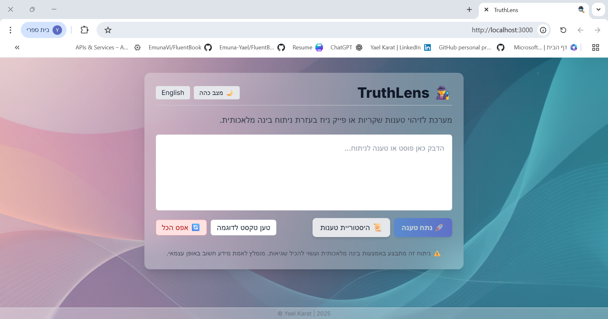
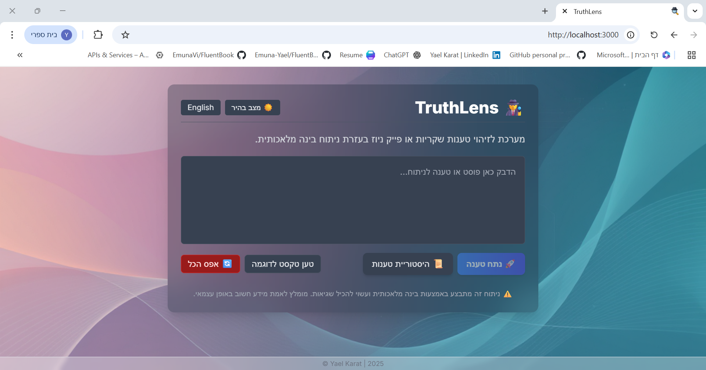

# TruthLens: AI-Powered Misinformation Detection Tool


## 📋 Table of Contents

- [Overview](#overview)
- [Features](#features)
- [Technology Stack](#technology-stack)
- [Installation](#installation)
- [Usage](#usage)
- [AI Integration](#ai-integration)
- [Project Structure](#project-structure)
- [Demo](#demo)
- [Testing](#testing)
- [Ethical Considerations](#ethical-considerations)
- [Limitations](#limitations)
- [Future Improvements](#future-improvements)
- [Contributing](#contributing)
- [License](#license)

## 🎯 Overview

TruthLens is an AI-powered misinformation detection tool designed to analyze and flag potentially misleading or biased information in social media content. The project was developed as part of the final project for "Between Theory and Practice: Preparing for Computing World Challenges" course.

This tool helps users evaluate the truthfulness of tweets, posts, headlines, and other short-form content by leveraging advanced AI technologies and fact-checking APIs.

### Project Goals

- **Critical Thinking Enhancement**: Assist users in developing digital literacy skills
- **Real-time Analysis**: Provide immediate feedback on content credibility
- **Bias Detection**: Identify potential cognitive biases and logical fallacies
- **Ethical AI Usage**: Demonstrate responsible implementation of AI technologies

## ✨ Features

### Core Functionality

- **Content Analysis**: Accepts tweets, posts, headlines, and short-form social media content
- **AI-Powered Detection**: Uses multiple AI models to assess content credibility
- **Bias Identification**: Flags potential cognitive biases and logical fallacies
- **Source Verification**: Cross-references claims with reliable fact-checking databases
- **User-Friendly Interface**: Clean, intuitive design for seamless user experience

### Advanced Features

- **Multi-Model Analysis**: Combines results from different AI APIs for comprehensive assessment
- **Real-time Processing**: Instant analysis and feedback
- **History Tracking**: Saves analysis history in `history.json` for pattern recognition
- **Component-Based UI**: Modular React components (`AnalysisResult.jsx`, `HistoryPage.jsx`)
- **Responsive Design**: Tailwind CSS for mobile-friendly interface

## 🛠 Technology Stack

### Backend (Python Flask)

- **Flask** - Web application framework
- **Python 3.x** - Server-side programming language
- **ai_integration.py** - Custom AI services integration
- **JSON Storage** - Simple file-based data persistence

### Frontend (React.js)

- **React.js** - User interface framework
- **JSX** - React component syntax
- **Tailwind CSS** - Utility-first CSS framework
- **PostCSS** - CSS processing tool
- **Responsive Design** - Mobile-friendly interface

### AI & APIs

- **Google Fact Check API** - Cross-referencing claims
- **OpenAI GPT** - Natural language processing and analysis

### Development Tools

- **GitHub** - Version control and collaboration
- **npm** - Package management
- **Postman** - API testing
- **VS Code** - Development environment

## 🚀 Installation

### Prerequisites

- Python 3.8+ (for backend)
- npm (for frontend)
- Git

### Clone the Repository

```bash
git clone https://github.com/Yael-Karat/truthlens.git
cd TRUTHLENS
```

### Backend Setup (Python Flask)

```bash
# Navigate to backend directory
cd backend

# Create virtual environment (recommended)
python -m venv venv

# Activate virtual environment
# On Windows:
venv\Scripts\activate
# On macOS/Linux:
source venv/bin/activate

# Install Python dependencies
pip install -r requirements.txt

# Create .env file with your API keys
# Copy the example below and add your actual API keys
```

### Frontend Setup (React.js)

```bash
# Navigate to frontend directory
cd frontend

# Install npm dependencies
npm install

# The project uses Tailwind CSS which is already configured
```

### Environment Configuration

Create a `.env` file in the backend directory:

```env
# AI API Keys
OPENAI_API_KEY=your_openai_api_key_here
```

### Start the Application

```bash
# Start backend server (from backend directory)
venv\Scripts\activate
cd backend
python app.py

# Start frontend (in another terminal, from frontend directory)
venv\Scripts\activate
cd frontend
npm run start
```

The backend will run on `http://127.0.0.1:5000`
The frontend will be available at `http://localhost:3000`

## 💡 Usage

### Basic Usage

1. **Input Content**: Paste or type the content you want to analyze
2. **Select Analysis Type**: Choose between quick scan or detailed analysis
3. **Review Results**: Examine the AI-generated credibility assessment
4. **Explore Details**: Click on flagged items to understand specific issues

### Example Analysis Flow

```
Input: "Breaking: Scientists discover cure for aging!"
↓
AI Processing: Content analysis, source verification, bias detection
↓
Output:
- Credibility Score: 2/10
- Issues Found: Sensationalist language, no credible sources
- Biases Detected: Confirmation bias, recency bias
- Recommendations: Verify with peer-reviewed sources
```

## 🤖 AI Integration

### Prompt Engineering

The project uses carefully crafted prompts to maximize AI effectiveness:

```javascript
const analysisPrompt = `
Analyze the following content for misinformation indicators:
Content: "${userInput}"

Evaluate for:
1. Factual accuracy
2. Source credibility
3. Logical fallacies
4. Emotional manipulation
5. Bias indicators

Provide structured response with confidence scores.
`;
```

### AI Models Used

- **Google Fact Check API** - Cross-referencing claims
- **OpenAI GPT**: Primary analysis engine for content evaluation (integrated via `ai_integration.py`)
- **Custom Python Integration**: Flask-based backend for AI service orchestration

### Backend AI Integration (`ai_integration.py`)

The backend handles all AI communications through a dedicated Python module:

```python
# Example from ai_integration.py structure
def analyze_content(text_content):
    """
    Analyzes content using multiple AI services
    Returns structured response with credibility scores
    """
    # Integration with OpenAI API
    # Integration with Perplexity API
    # Bias detection algorithms
    # Return combined analysis
```

### Data Persistence

- **history.json**: Stores analysis results and user interactions
- **File-based storage**: Simple JSON format for easy data management
- **Session tracking**: Maintains user analysis history

### Limitations & Mitigation

- **Hallucination Detection**: Cross-validation between multiple AI models
- **Context Awareness**: Prompts include relevant context and constraints
- **Consistency Checks**: Multiple analysis runs for critical content

## 📁 Project Structure

```
TRUTHLENS/
├── .vscode/                   # VS Code settings
├── backend/
│   ├── __pycache__/           # Python cache files
│   ├── .env                   # Environment variables (API keys, config)
│   ├── ai_integration.py      # AI services integration (OpenAI)
│   ├── app.py                 # Main Flask application server
│   ├── history.json           # Analysis history storage
│   └── requirements.txt       # Python dependencies
├── frontend/
│   ├── node_modules/          # NPM dependencies
│   ├── public/
│   │   ├── images/
│   │   │   ├── favicon.ico               # Website favicon/icon
│   │   │   ├── ClaimAnalysis.png         # Screenshot of claim analysis feature
│   │   │   ├── CognitiveBiasesExample.png # Example of cognitive bias detection
│   │   │   ├── DarkModeEnglish.png       # Dark mode interface in English
│   │   │   ├── DarkModeHebrew.png        # Dark mode interface in Hebrew
│   │   │   ├── EnglishClaimAnalysis.png  # English version of claim analysis
│   │   │   ├── HistoryPage.png           # History page interface screenshot
│   │   │   └── HomePage.png              # Main homepage interface
│   │   └── index.html                    # Main HTML template
│   ├── src/
│   │   ├── assets/
│   │   │   ├── images/
│   │   │   │    └── background-gradient.png   # Background images
│   │   ├── components/
│   │   │   ├── AnalysisResult.jsx    # Results display component
│   │   │   └── HistoryPage.jsx       # History page component
│   │   ├── styles/
│   │   │   ├── AnalysisResult.css    # Results styling
│   │   │   ├── App.css               # Main app styling
│   │   │   ├── History.css           # History page styling
│   │   │   └── index.css             # Global styles
│   │   ├── App.js             # Main React application
│   │   └── index.js           # React entry point
│   ├── package-lock.json      # NPM lock file
│   ├── package.json           # NPM dependencies and scripts
│   ├── postcss.config.js      # PostCSS configuration
│   ├── README.md              # Frontend-specific documentation
│   └── tailwind.config.js     # Tailwind CSS configuration
├── venv/                      # Python virtual environment (misplaced)
├── .gitignore                 # Root git ignore
└── README.md                  # Main project documentation
```

## 🎬 Demo

### Video Demonstration

[Link to demo video] <!-- הוסף קישור לסרטון הדגמה -->

### Screenshots







## ⚖️ Ethical Considerations

### Key Ethical Principles

1. **Transparency**: Clear disclosure of AI limitations and decision-making process
2. **Bias Awareness**: Recognition and mitigation of algorithmic biases
3. **User Autonomy**: Tool assists rather than replaces human judgment
4. **Privacy Protection**: No storage of personal or sensitive information

### Misinformation Labeling Ethics

- **Contextual Sensitivity**: Considers cultural and social context
- **Uncertainty Communication**: Clearly indicates confidence levels
- **Appeal Process**: Allows users to question and challenge results
- **Continuous Learning**: Regular updates based on user feedback and new research

## 🚧 Limitations

### Technical Limitations

- **Language Support**: Currently optimized for English content
- **Content Types**: Limited to text-based short-form content
- **Real-time Constraints**: Processing time varies with content complexity
- **API Dependencies**: Reliant on third-party AI service availability

### AI-Specific Limitations

- **Context Understanding**: May miss nuanced cultural or temporal context
- **Hallucination Risk**: AI models may generate inaccurate assessments
- **Bias Inheritance**: Models may reflect training data biases
- **Evolving Misinformation**: New tactics may not be immediately detected

## 🔮 Future Improvements

### Planned Features

- **Multi-language Support**: Expand to Hebrew, Arabic, and other languages
- **Image Analysis**: Include visual content misinformation detection
- **Browser Extension**: Chrome/Firefox extension for seamless integration

### Technical Enhancements

- **Machine Learning Pipeline**: Custom model training on domain-specific data
- **Real-time Alerts**: Push notifications for trending misinformation
- **Community Features**: User reporting and collaborative fact-checking
- **Advanced Analytics**: Trend analysis and misinformation pattern recognition

## 🤝 Contributing

We welcome contributions from the community! Please see our [Contributing Guidelines](CONTRIBUTING.md) for details.

### How to Contribute

1. Fork the repository
2. Create a feature branch (`git checkout -b feature/AmazingFeature`)
3. Commit your changes (`git commit -m 'Add some AmazingFeature'`)
4. Push to the branch (`git push origin feature/AmazingFeature`)
5. Open a Pull Request

### Code of Conduct

Please read our [Code of Conduct](CODE_OF_CONDUCT.md) before contributing.

## 📄 License

This project is licensed under the MIT License - see the [LICENSE](LICENSE) file for details.

## 📞 Contact

**Yael Karat** - [GitHub Profile](https://github.com/Yael-Karat)

Project Link: [https://github.com/Yael-Karat/truthlens](https://github.com/Yael-Karat/truthlens)

Email: yaelkarat01@gmail.com

---

## 🙏 Acknowledgments

- Course Instructor for project guidance and requirements
- Open source community for tools and libraries used
- Beta testers and feedback providers

---

**Note**: This project was developed as part of an academic assignment focusing on AI ethics, critical thinking, and digital literacy. It is intended for educational and research purposes.

---

_"In an age of information abundance, the ability to distinguish truth from fiction is not just a skill—it's a necessity."_
